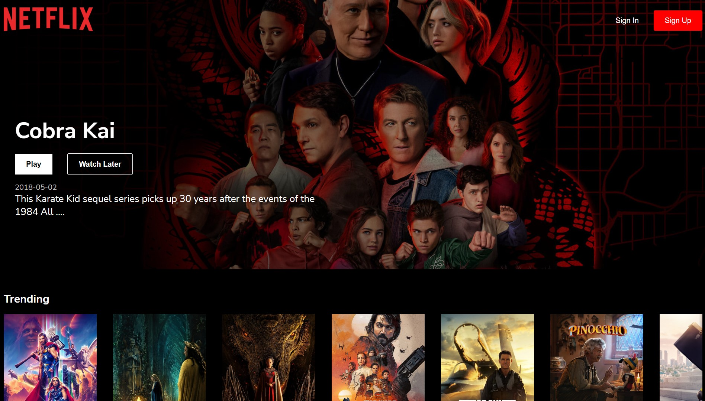

Repository for the website clones..

# Netflix Clone
(Live)[https://yes-netflix.netlify.app/]

* Technology used: React Js, Some external npm Pakages, API.
* CSS is used for design here.
* npm packages used: react-youtube , axios, movie-trailer, react-cookie, react-router-dom.
* API used: Tmdb for movies data and posters.
* react-cookies: For securing the user cookies and save it from the third party.
* react-youtube: For youtube player
* movie-trailer: For searching movie by it's name and returning the promise as url
* react-router-dom: For switching between Sign In, Sign out and Home page without loading the page again and again.

# Amazon Clone
(Live)[https://yes-amazon.netlify.app/]

* Technology used: React Js, Tailwind CSS.
* Tailwind is used for design here.
* React router Dom is used for switching between the cart, Sign in and home Pages.
* Local storage is used for saving the user data and re-render it on every page loading.

# Digital Ocean Landing Page
(Live)[https://yes-digitalocean.netlify.app/]

* Technology used: React Js, Tailwind CSS.
* Tailwind CSS and CSS both is used for design here.
* UseReducer hook is used to change toggle the array of data.
* Some Animation are also added for beter user experience.
* Responsive at different screen width.

